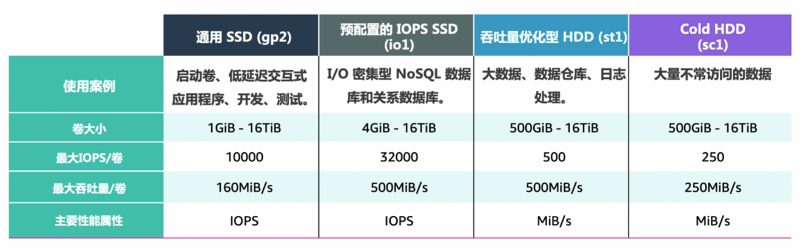
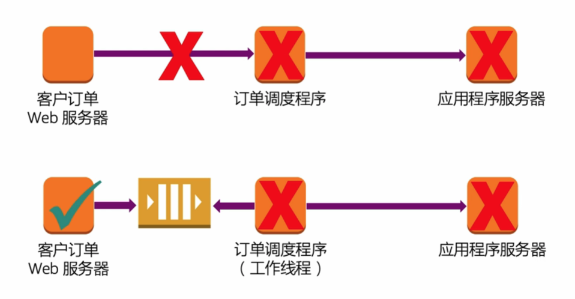
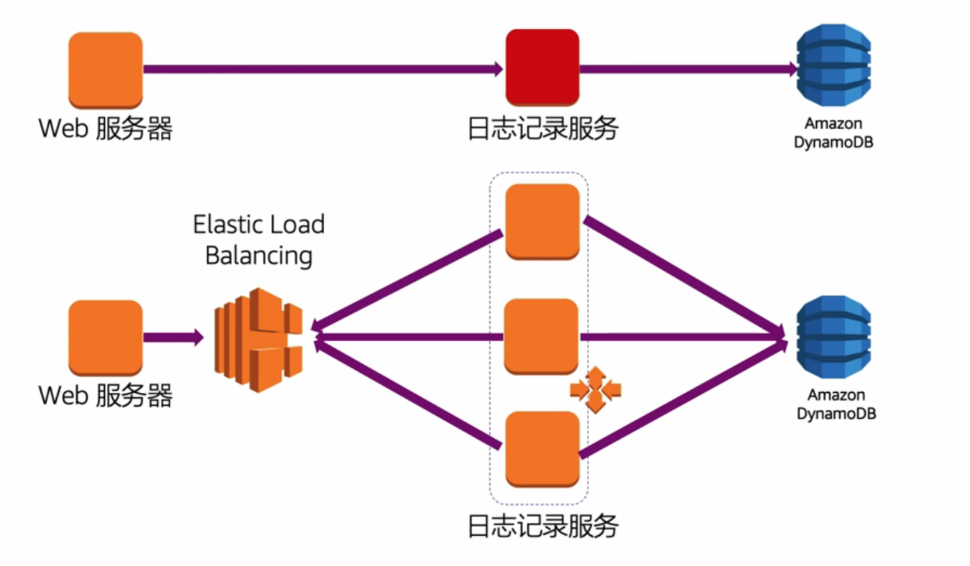
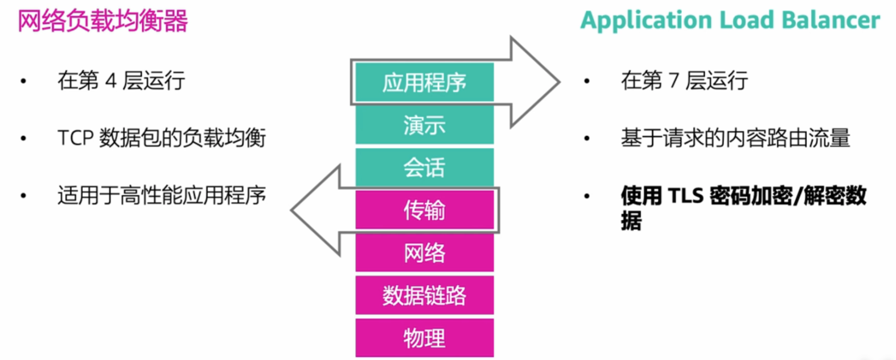
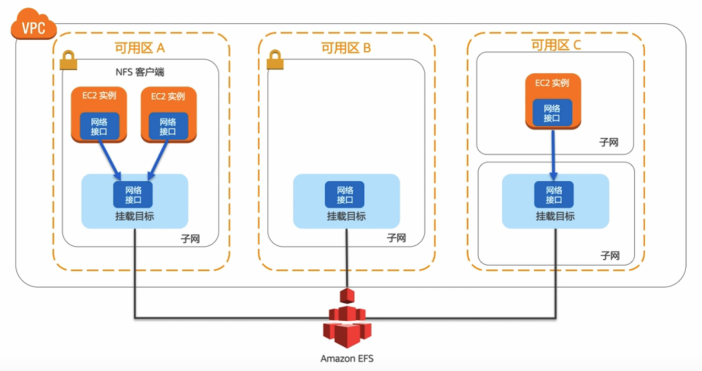
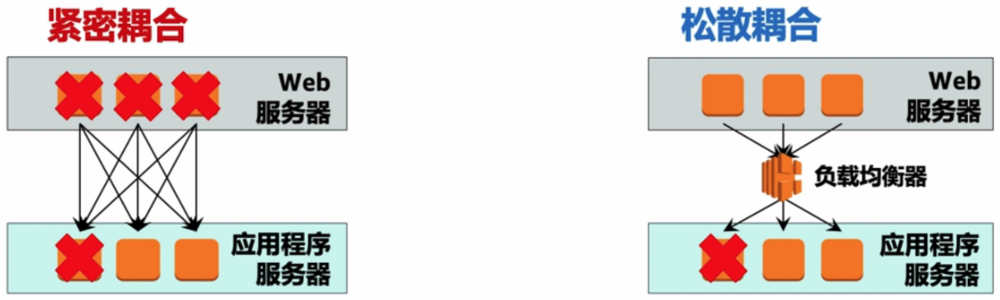
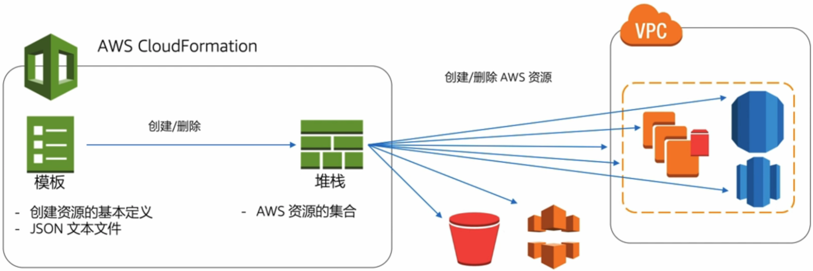

## 考试大纲

1. 选择可靠/弹性存储。
2. 确定如何使用 AWS 服务设计解耦机制。
3. 确定如何设计多层架构存储解决方案。
4. 确定如何设计高可用性和/或容错解决方案。

## 选择可靠/弹性存储

### Amazon EC2 实例存储

- 临时卷
- 仅限某些 EC2 实例
- 磁盘类型和容量取决于实例类型
- 应用程序级持久性
- 不可靠存储

### Amazon Elastic Block Store (Amazon EBS)

- 提供块级存储
- 与 EC2 实例连接到同一可用区中
- 保持实例的独立性
- 提供对数据的快速访问和长期持久性
- 快照

### 样题

1. **数据库**正在 **Amazon EC2 实例**中运行。数据库软件的备份功能**需要块存储**。
    **备份数据**的**最低成本存储**选项是什么? (B)
    A. Amazon Glacier
    **B. Amazon EBS Cold HDD 卷 (sc1)**
    C. Amazon S3
    D. Amazon EBS 吞吐量优化型 HDD 卷 (st1)

    分析:
    A. 不是块存储。
    C. 不是块存储。
    D. st1 主要用于大数据、数据仓库、日志处理，在该场景中**非最低成本卷类型**。

2. 公司决定在 **Amazon EC2 实例**上托管服务器。此服务器的主要要求是**处理大量日志**。
    以下哪种 Amazon EBS 卷类型**最适合**此实施? (D)
    A. Amazon EBS 预配置 IOPS (io1)
    B. Amazon EBS Cold HDD 卷 (sc1)
    C. Amazon EBS 通用型 SSD (gp2)
    **D. Amazon EBS 吞吐量优化型 HDD 卷 (st1)**
    分析:
    处理大量日志的主要瓶颈是吞吐量，四个选项中吞吐量最优的是 st1。

## 使用 AWS 服务设计解耦机制

### SQS

通过 SQS 解耦 Web Server 和订单调度程序。

### 负载均衡

通过负载均衡器解耦 Web Server 和日志记录服务。

#### 选择负载均衡器

### 样题

1. 以下哪些 AWS 服务可以促进**松散耦合架构**的实施? (选择两项) (BD)
    A. AWS CloudFormation
    **B. Amazon Simple Queue Service**
    C. AWS CloudTrail
    **D. Elastic Load Balancing**
    E. Amazon EMR
    分析:
    A. 用于启动组件堆栈，服务搭建
    C. 提供日志记录服务
    E. Amazon Elastic MapReduce，托管 Hadoop，大数据平台

## 设计多层架构存储解决方案

### Amazon Elastic File System (EFS)

- AWS 云中的文件存储
- 共享存储
- PB 级文件系统
- 弹性容量
- NFS v4.0 和 4.1 (NFSv4) 协议
- 与适用于 Amazon EC2 的基于 Linux 的 AMI 兼容

### Amazon Simple Storage Service (Amazon S3)

- 几乎不受限制的容量
- 区域可用性
- 高持久性 - 99.999999999%
- 存储类和持久性
- 加密 (静态数据)
    1. SS3-S3
    2. SSE-KMS
    3. SSE-C
- 加密 (传输中的数据)
    1. TLS
- 用于实现快速数据恢复的版本控制

#### Amazon S3 访问控制

1. 对象 ACL
2. 存储桶 ACL
3. 存储桶策略
4. IAM 策略

### Amazon Glacier

- 数据备份和归档存储
- 文件库和档案
- 检索 - 加速、标准、批量
- 加密
- Amazon S3 对象生命周期策略
- 区域可用性
- 高持久性 - 99.999999999%

## 设计高可用性和/或容错解决方案

### 容错能力

系统耦合越松散，越容易扩展，容错能力就越强。

### AWS CloudFormation

### 样题

1. 您的 Web 服务有一个性能 SLA，要求在 5 秒内响应 90% 的请求。在正常和频繁的操作下，**将请求分布到四个实例能够满足性能要求**。
    如果一个可用区变得不可访问，那么什么架构可以确保您的服务具有**经济有效的高可用性**? (D)
    A. 在单一可用区中的四个服务器上部署服务。
    B. 在单一可用区中的六个服务器上部署服务。
    **C. 在两个可用区中带有 Auto Scaling 的四个服务器上部署服务。**
    D. 在两个可用区中带有 Auto Scaling 的八个服务器上部署服务。
    分析:
    A. 不推荐单可用区
    B. 不推荐单可用区
    D. 属于容错性部署
    高可用性和高容错性的区别是，高可用性的服务宕机能够被用户感知到，而高容错性的服务宕机不会被用户感知。
    题中四个实例能够满足性能要求，并且只要求高可用性，无需高容错性。
2. 您计划使用 AWS CloudFormation 在**两个**使用**同一基础 Amazon 系统映像 (AMI)** 的**不同区域**内部署 Linux EC2 实例。
    如何使用 AWS CloudFormation 执行此操作? (B)
    A. 由于 AWS CloudFormation 模版是特定于区域的，使用两个不同的 AWS CloudFormation 模版。
    **B. 由于每个区域的 AMI ID 都不同，使用映射指定基础 AMI。**
    C. 由于每个区域的 AMI ID 都不同，使用参数指定基础 AMI。
    D. 每个区域的 AMI ID 相同。
    分析:
    A. 可以做到不同区域用同一 AMI，特定于区域不是必需的。
    C. 参数是需要用户输入的，AMI ID 不适合通过参数指定。
    D. 不同区域的 AMI ID 是不一样的。
