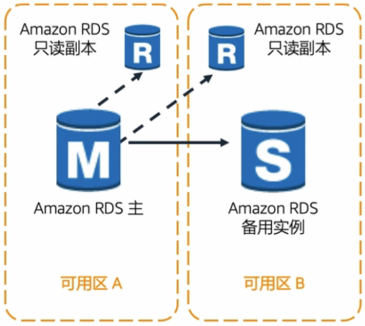

## 考试大纲

1. 选择高性能存储和数据库
2. 应用缓存来提高性能
3. 设计具有弹性和可扩展性的解决方案

## 高性能存储和数据库

### 高性能存储

#### Amazon Elastic Block Store (Amazon EBS)

#### Amazon Simple Storage Service (Amazon S3)

##### 付费模式

- 按使用量付费
    - 每月 GB 数
    - 传出所在区域
    - PUT, COPY, POST, LIST 和 GET 请求
- 免费
    - 传入 Amazon S3
    - 从 Amazon S3 传出至相同区域的另一个服务
    - 传出至 CloudFront

- Amazon S3 标准 - 通用

    - 灾难恢复/业务连续性: 使用跨区域复制

- Amazon S3 标准 - 低频率访问

    - 不常访问的数据

    - 每 GB 的存储成本更低
    - 恢复或访问数据的成本更高
    - 每个 PUT, COPY, POST 或者 GET 请求的成本更高
    - 至少存储 30 天

##### 生命周期

Amazon S3 生命周期策略让您可以根据存在时间来删除或移动对象。

#### 例题

1. Amazon S3 对象存储在哪些方面不同于块和文件存储? (选择两项) (AB)
    **A. Amazon S3 允许存储无限量的对象。**
    **B. 对象不可变 - 即使只想更改一个字节，也需要替换对象。**
    C. 跨所有可用区复制对象。
    D. 跨所有区域复制对象。
    分析:
    C. S3 IA 对象仅可在 1 个可用区复制。
    D. 对象跨单个区域内的可用区复制，而不是跨所有区域复制。
2. 以下哪些功能属于 Amazon EBS ? (选择两项) (AC)
    **A. 存储在 Amazon EBS 上的数据是在可用区中自动复制的。**
    B. Amazon EBS 数据会自动备份至磁带。
    **C. Amazon EBS 卷可以加密。**
    D. Amazon EBS 卷可以附加到同一可用区中的多个实例上。
    分析:
    A. Amazon EBS 可以在可用区内部自动复制，但是不能跨可用区复制。
    B. Amazon EBS 不会自动备份，需要编写代码/脚本实现。
    C. Amazon EBS 可以加密，并且可以通过 KMS 管理密钥。
    D. 一个 EBS 只能挂载到一个实例上，就如同一个硬盘不能同时挂载到两台电脑上。

### Amazon 数据库服务

#### Amazon RDS

##### 使用场景

- 使用 Amazon RDS
    - 复杂的事务处理/复杂查询
    - A 中到高的查询/写入速率
    - 不超过一个工作程序节点/分区
    - 高持久性
- 不使用 Amazon RDS
    - 极大的读写速率 (如 150K 写入/秒)
    - 分区
    - 简单的 GET/PUT 请求和查询
    - RDBMS 自定义

##### 只读副本

- 增强的性能和持久性
- 弹性扩展，超出容量
- 高容量应用程序读取流量
- 只读副本提升到独立副本

#### Amazon DynamoDB

##### 预配置吞吐量

- 资源分配基于读/写吞吐量容量要求。
- 读取容量单位 (对于大小不超过 4KB 的项目)
    - 每秒一次强一致性读取
    - 每秒两次最终一致性读取
- 写入容量单位 (对于大小不超过 1KB 的项目)
    - 每秒一次写入

#### 例题

1. 哪些使用案例适合于 Amazon RDS 数据库引擎 ? (选择两项) (AD)
    **A. 复杂的事务处理**
    B. 分区
    C. 简单的 GET/PUT 请求和查询
    **D. A中到高的查询/写入速率**
    E. RDBMS 自定义
    分析:
    BC. 非关系型数据库，E 关系型数据库不支持。
2. 哪种 AWS 数据库服务最适合非关系数据库 ? (D)
    A. Amazon Redshift
    B. Amazon RDS
    C. Amazon Glacier
    **D. Amazon DynamoDB**
    分析:
    A. 适合对大型数据集运行大查询
    B. 结构化关系数据库
    C. 非数据库服务
3. 一个应用程序需要一个初始存储容量为 4TB 的**关系数据库**。数据库将每天**增长** 10 GB。为了支持流量，至少需要四个**只读副本**，以处理读取。
    哪个选项将满足这些要求 ? (C)
    A. DynamoDB
    B. Amazon S3
    **C. Amazon Aurora**
    D. Amazon Redshift
    分析:
    A. 非关系数据库
    B. 对象存储，非数据库服务
    D. 不支持只读副本，不会自动扩展

## 缓存

### Amazon CloudFront

- 内容 - 静态和动态
- 源 - S3, EC2, ELB, 本地服务器
- 私有内容保护
- 安全改进
    - AWS Shield Standard 和 Advanced
    - AWS WAF

### Amazon ElastiCache

#### Memcached

- 多线程
- 低维护量
- 简单使用 Auto Discovery 实现横向扩展

#### Redis

- 支持数据结构
- 持久性
- 原子操作
- 发布/订阅消息
- 只读副本/故障转移
- 集群模式/分片集群

### 例题

1. 以下哪些对象适合存储在缓存中 ? (选择三项) (ABC)
    **A. 会话状态**
    **B. 购物车**
    **C. 产品目录**
    D. 银行账户余额
    分析:
    D. 银行账户余额必需准确并保持最新
2. Amazon ElastiCache 支持以下哪种缓存引擎 ? (选择两项) (BC)
    A. MySQL
    **B. Memcached**
    **C. Redis**
    D. Couchbase

## 弹性和可扩展性

### Amazon EC2 Auto Scaling

- 启动或终止实例
- 自动将新实例注册到负载均衡器中
- 可以跨可用区启动
- 与 Elastic Load Balancing 集成

### AWS Auto Scaling

- Auto Scaling 策略
- Auto Scaling 组
- Auto Scaling 计划

| AWS Auto Scaling                                             | Amazon EC2 Auto Scaling                                      |
| :----------------------------------------------------------- | :----------------------------------------------------------- |
| - 管理跨多项服务、多个资源的扩展 - 提供预定义的扩展策略 | -只需管理和扩展 EC2 Auto Scaling 组 - 只需致力于维护 EC2 队列的运行状况 |

### Amazon CloudWatch

- CloudWatch 可以监控:
    - CPU
    - 网络
    - 队列大小
- CloudWatch 自定义指标

### Elastic Load Balancing

### 实施连续性

### 例题

1. 哪些服务可以共同实现 Amazon EC2 实例的自动扩展 ? (C)
    A. Amazon EC2 Auto Scaling 和 Elastic Load Balancer
    B. Amazon EC2 Auto Scaling 和 CloudWatch
    **C. Amazon EC2 Auto Scaling, Elastic Load Balancer 和 CloudWatch**
    D. Amazon EC2 Elastic Load Balancer 和 CloudWatch
    E. Amazon EC2 Auto Scaling
    分析:
    弹性扩展铁三角
2. 一家广播电台举办了一场比赛，他们**每天中午**会发布公告，由此产生了需要 **8 个 Amazon EC2 实例**来处理的**即时流量高峰**。网站在其他时间需要 **2 个 EC2 实例**。
    满足这些需求**最经济有效**的方式是什么 ? (C)
    A. 创建一个最低容量为 2 的 Auto Scaling 组，并根据 CPU 的使用率扩展。
    B. 创建一个最低容量始终为 8 的 Auto Scaling 组。
    **C. 创建一个最低容量为 2 的 Auto Scaling 组，并设置一个上午 11:40 扩展的计划。**
    D. 创建一个最低容量为 2 的 Auto Scaling 组，并根据内存使用率扩展。
    分析:
    A. 实例的启动有延时
    B. 超额配置
    D. 不是本地 CloudWatch 事件
3. 以下哪些是 AWS 上的 Amazon EC2 Auto Scaling 具备的特点 ? (选择三项) (BEF)
    A. 将流量发送到正常运行的实例。
    **B. 通过添加或终止 Amazon EC2 实例来响应不断变化的条件。**
    C. 收集和跟踪指标并设置报警。
    D. 传输推送通知。
    **E. 从指定的 Amazon 系统映像 (AMI) 中启动实例。**
    **F. 运行最低数量的 Amazon EC2 实例。**
    分析:
    A. Amazon Elastic Load Balancer
    B. EC2 Auto Scaling 基本功能
    C. CloudWatch
    D. Amazon SNS
    E. EC2 Auto Scaling Launch Configuration
    F. 可以在 EC2 Auto Scaling 中设置最低数量的 EC2 实例

## 注意事项

1. 有策略地使用缓存可以提高性能，注意 Hit Rate。
2. 对于非结构化数据，一般采用 Amazon S3 作为存储解决方案。
3. 知道使用 Auto Scaling 的时间和原因。
4. 选择最适合工作负载和性能需求的实例和数据库类型。

