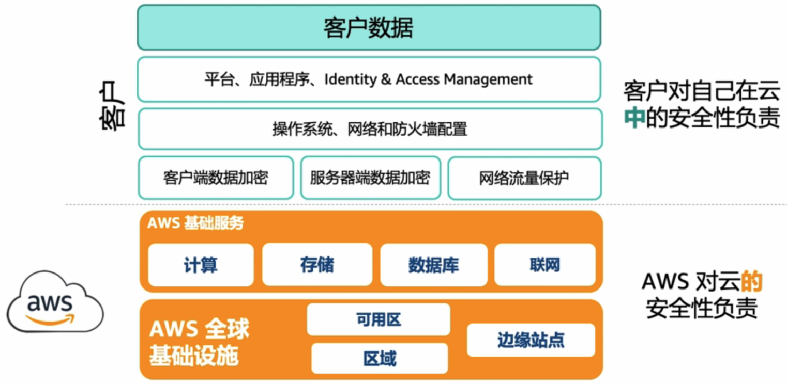
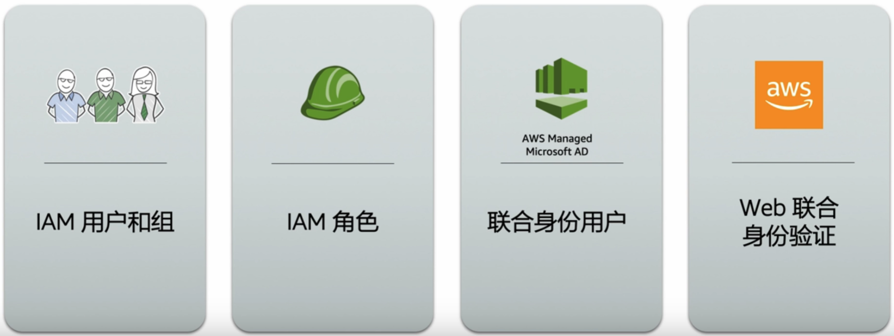
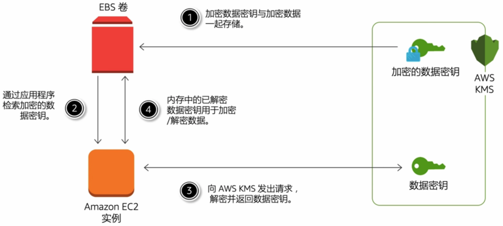
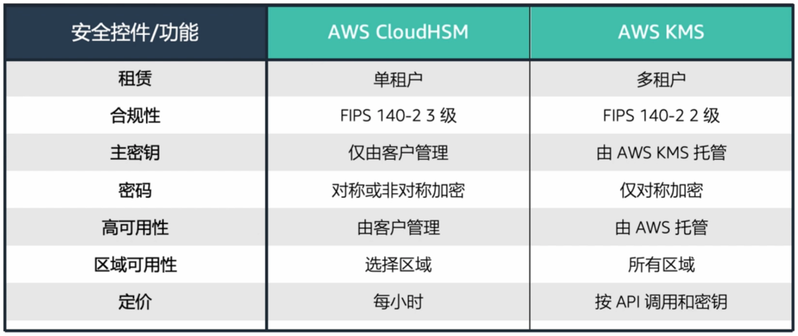
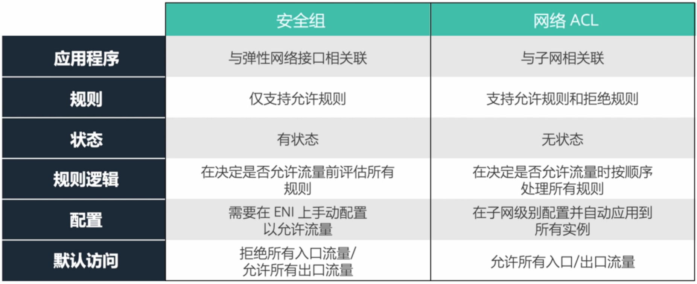
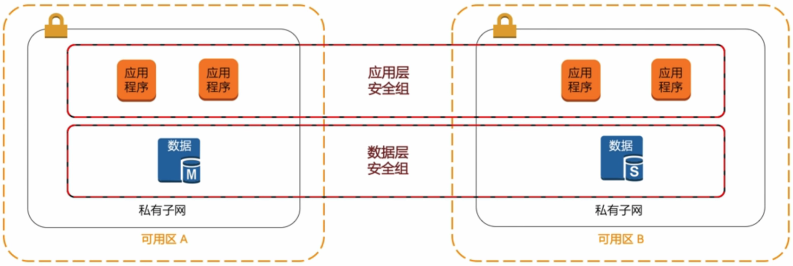
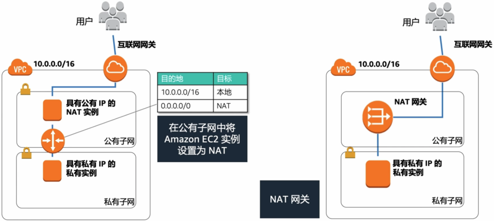

## 考试大纲

1. 确定如何保护应用程序层。
2. 确定如何保护数据。
3. 为单个 VPC 应用程序定义联网基础设施。

## 保护应用程序层

### 责任共担模型

### AWS Identity and Access Management (IAM)

- 集中管理用户和用户权限
- 控制用户/应用程序可以访问哪些 AWS 资源
- 创建用户、组、角色和策略
- 与 Microsoft Active Directory 和 AWS Directory Service 集成
- 最低权限原则

### 样题

1. 您的 AWS 账户管理员今天离开了公司。该管理员拥有**根用户**权限，还有一个个人 **IAM 管理员账户**。他利用这些账户生成过其他 **IAM 用户和密钥**。
    您需要采取以下哪些措施来保护您的 AWS 基础设施 ? (选择三项) (ACE)
    **A. 更改密码并将 MFA 添加至根用户。**
    B. 对根用户登陆设置一个 IP 限制。
    **C. 轮换密钥并更改 IAM 用户密码。**
    D. 删除所有 IAM 用户。
    **E. 删除管理员的 IAM 用户。**
    F. 用新角色重新启动所有 EC2 实例。
    分析:
    A. 推荐有一个物理的 MFA，并且把它锁到保险箱里。当需要使用根用户的时候，就需要有一个正规的流程去申请使用，避免误操作。
    B. 当前不支持对根用户 (Root User) 限制 IP，同时应尽量避免使用根用户做操作。
    D. 不需要删除所有 IAM 用户，会对正常工作的用户产生影响。
    F. 角色是临时凭证，一般几个小时就过期。
2. 您在 Amazon EC2 实例中托管了**新开发的应用程序**。此应用程序需要**访问 Amazon DynamoDB 表**。
    以下哪项是应用程序访问 DynamoDB 表的**最安全方法** ? (D)
    A. 将 API 凭证配置到 EC2 实例用户数据中以实现自动化。
    B. 将 API 凭证存储在 Amazon S3 以获得持久性。
    C. 在应用程序代码中将 API 凭证嵌入 DynamoDB。
    **D. 将 IAM 角色分配到 EC2 实例。**
    分析:
    ABC 都需要持久化的 AKSK，会有暴露风险。

## 保护数据

### 数据加密

#### 传输中的数据加密

- 将数据传入/传出 AWS 基础设施
    - Web 上的 SSL/TLS
    - 用于本地连接的 IPsec
        - VPN
        - AWS Direct Connect
    - 导入/导出/Snowball
- 发送到 AWS API 的数据
    - AWS API 调用使用 HTTPS
    - 所有调用都使用 Sigv4 签名

#### 静态数据加密

存储在 Amazon S3 中的数据默认认为私有数据，需要 AWS 凭证才能访问

- 通过 HTTP/HTTPS 访问
- 审核对所有对象的访问
- 支持基于资源的策略
    - 存储桶
    - 前缀 (目录/文件夹)
    - 对象

#### 服务器端加密

- Amazon S3 托管密钥 (SSE-S3)
- AWS KMS 托管密钥 (SSE-KMS)
- 客户提供密钥 (SSE-C)

#### 客户端加密

- AWS KMS 托管的客户主密钥 (CSE-KMS)
- 客户端主密钥 (CSR-C)

### AWS Key Management Service (AWS KMS)

- 加密密钥管理服务
- 允许导入客户密钥材料
- 直接接受来自应用程序的密钥加密/解密调用
- 自动轮换密钥和管理旧密钥的使用

#### Amazon EBS 集成示例

### AWS CloudHSM

- 基于硬件的密钥管理
- 安全生成和存储密钥
- 从应用程序直接使用
- 密钥只能由客户管理

#### 与 AWS KMS 对比

### 样题

1. 某公司使用 **EBS 卷**来存储托管在 EC2 实例上的**关键数据和机密数据**。根据新发布的要求，该公司需要**加密**所有 EBS 卷。
    以下哪项可用于满足此要求 ? (A)
    **A. AWS KMS**
    B. AWS Certificate Manager
    C. IAM 访问密钥
    D. 使用 AssumeRole 的 API Gateway
    分析:
    B. AWS Certificate Manager 用来管理证书凭证，主要用于加密传输中的数据，而不是静态数据。
    C. 用于 AWS API 调用，用于访问控制，而不是数据加密。
    D. AssumeRole 用于在使用 API Gateway 时发出令牌。

## VPC 联网基础设施

### Amazon Virtual Private Cloud (Amazon VPC)

- 安全性 - 访问控制列表、安全组
- 网络隔离 - 互联网网关、虚拟私有网关、NAT 网关
- IP 地址的管理
- Internet 可访问性 - 子网
- 路由

### 使用子网

#### 公有子网

- 支持直接访问公共 Internet
- 由互联网网关的路由表条目指定

#### 私有子网

- 没有互联网网关的路由表条目
- 通过 NAT 间接访问公共 Internet

### 防火墙

安全组与网络访问控制列表

#### 使用安全组

使用安全组控制传入/传出资源的流量，以及资源之间传输的流量。

### Amazon VPN 连接

- 互联网网关: 连接到 Internet
- 虚拟私有网关 (VGW): 连接到 VPN/Direct Connect 终止点
- AWS Direct Connect: 与本地网络的专用网络连接
- VPC 对等连接: 连接到其他 VPC
- NAT 网关: 允许私有子网间接访问 Internet

### 样题

1. 您需要在 ELB 后面的 EC2 实例上设计一个在 VPC 中运行的**在线应用程序**。应用程序层必须从客户管理的数据库集群中读取数据并将数据写入其中。**不得通过 Internet 访问数据库**，但该集群必须能够**从 Internet 获取软件修补程序**。
    以下哪种解决方案满足这些要求 ? (C)
    A. 适用于应用程序层和数据库集群的公有子网。
    B. 适用于应用程序层的公有子网，以及适用于数据库集群的私有子网。
    **C. 适用于应用程序层和 NAT 网关的公有子网，以及适用于数据库集群的私有子网。**
    D. 适用于应用程序层的公有子网，以及适用于数据库集群和 NAT 网关的私有有子网。
2. 您部署了一个运行 **Web 服务器的实例**。当您试图**通过 Internet 使用 HTTP** 连接到该实例时，连接会超时。
    以下哪些操作可以解决这个问题 ? (选择三项) (ACE)
    **A. 检查子网的路由表是否将 0.0.0.0/0 路由到互联网网关。**
    B. 检查子网的路由表是否将 0.0.0.0/0 路由到虚拟私有网关。
    **C. 检查安全组是否允许端口 80 上的入站访问。**
    D. 检查安全组是否允许端口 80 上的出站访问。
    **E. 检查自定义网络 ACL 是否允许端口 80 上的入站访问。**
    分析:
    B. 虚拟私有网关 (VGW) 请求来自 VPN，而不是 Internet。
    D. 当前场景时入站访问，而不是出站访问。

## 注意事项

1. 锁定 AWS 账户根用户。
2. 安全组只会运行。网络 ACL 允许明确拒绝。
3. 优先使用 IAM 角色而不是访问密钥。

