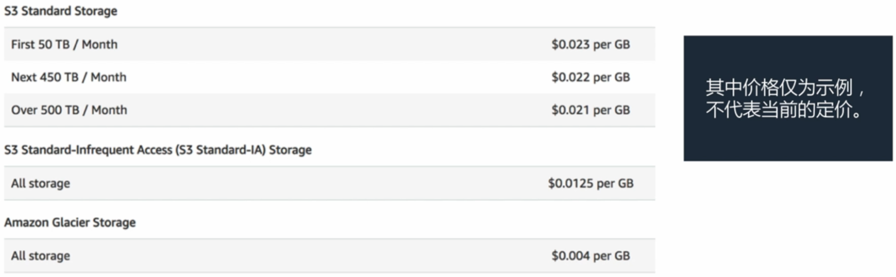

## 考试大纲

1. 确定如何设计成本优化型存储
2. 确定如何设计成本优化型计算

## AWS 定价

### 定价模型

- 按使用量付费

- 预留容量，付费更少

- 用量越大，单位费用越少

### 定价特性

- 计算
- 存储
- 数据传输

## 成本优化型存储

### Amazon S3

#### 成本考虑因素

- 存储类

    - 标准存储
    - 标准 - Infrequent Access
    - Amazon Glacier

    

- 存储

- 请求

- 数据传输

### Amazon EBS

#### 成本考虑因素

- 卷类型
- IOPS
- 快照
- 卷大小

#### 成本优化

定期监控 EBS 卷，

- 删除未连接的 Amazon EBS 卷
- 更改 EBS 卷类型或调整其大小
- 删除过时的 Amazon EBS 快照

### Amazon CloudFront

使用 CloudFront 缓存可以提高性能和成本优化

#### 成本考虑因素

- 流量分布
- 请求
- 数据传出

#### 成本优化

- S3 和 CloudFront 之间的数据传输成本为零
- 可以用于降低 EC2 实例的计算工作负载

### 样题

1. 您需要制作一个要在 Web 上**公开**的 PDF 文件。该文件会通过客户的浏览器下载**数百万次**。
    哪种选项**最具成本效益** ? (A)
    **A. 将文件存储在 Amazon S3 Standard 中。**
    B. 将文件存储在 Amazon S3 Standard - Infrequent Access (S3 Standard - IA) 中。
    C. 将文件存储在 Amazon Glacier 中。
    D. 将文件存储在 Amazon Elastic File System (Amazon EFS) 中。
    分析:
    A. 其实还有更具成本效益的方案，就是打开 BT (BitComet) 下载。这样文件下载就不是从 S3 到客户，而是从客户到客户，能够减少大量 S3 请求。
    B. S3 Standard - IA 存储成本较低，但频繁检索的成本很昂贵。
    C. Amazon Glacier 不支持公有文件，有访问延时，不适合频繁读取。
    D. Amazon EFS 不支持公有文件，访问 EFS 文件需要搭载 EC2 (HTTP/FTP) 服务器，反而扩大成本。

## 成本优化型计算

### Amazon EC2

#### 成本考虑因素

- 时钟时间
- 实例系列
- 实例购买类型
- 实例数量
- 租凭
- 详细监控
- 自动扩展
- 弹性 IP 地址
- 操作系统和软件标题

#### 成本优化

- 预留实例 Reserved Instances (RI)
    - 与按需定价相比，折扣高达 75%
    - RI 类型
        - 标准 RI
        - 可转换 RI
        - 计划 RI
- Spot 实例
    - AWS 中的备用计算容量
    - 与按需定价相比，折扣为 30% 到 45%

### 无服务器架构

- AWS Lambda
- Amazon S3
- Amazon DynamoDB
- Amazon API Gateway

### 样题

1. 您**每周日晚上**都必须运行一项批处理任务。该任务要在 90 分钟内完成并且**不能延期**。
    您应当使用哪种 Amazon EC2 付费模型达到**最优价格** ? (C)
    A. 按需实例
    B. 预留实例
    **C. 计划的预留实例**
    D. Spot 实例
    分析:
    A. 四个选项中最贵方案
    B. 不允许任务时，预留容量就会浪费

    D. Spot 竞价实例有可能会造成任务延期

## 注意事项

1. 预留要持续运行的实例。
2. 针对每项工作负载，确定最具成本效益的 EC2 定价模式和实例类型。
3. 任何未使用的 CPU 时间都是在浪费金钱。
4. 使用最具成本效益的数据存储服务和存储类。
