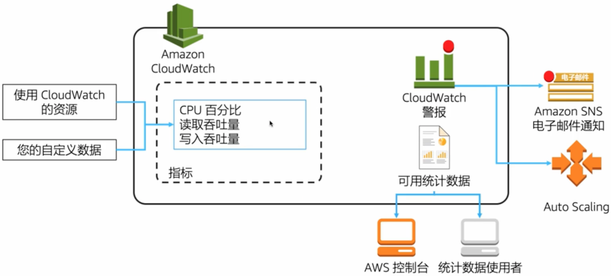

## 考试大纲

1. 在能够实现卓越运行的解决方案中选择设计功能

## 卓越运行

能够运行和监控系统，交付业务价值，并不断改进支持流程和程序。

- 准备
- 运行
- 改进

### 设计原则

- 利用代码执行运行
- 注释文档
- 进行频繁、可逆的微小更改
- 经常优化运行程序
- 预见故障
- 从所有运行故障中吸取教训

### 支持服务

- AWS Config
- AWS CloudFormation
- AWS Trusted Advisor
- Amazon Inspector
- Amazon VPC 流日志
- AWS CloudTrail
- Amazon CloudWatch

## 样题

1. 为了监控 RDS DB 实例上的 CPU 利用率，您设置了一个 CloudWatch 警报，在 **3 个 5 分钟的时段内**阈值为 **70%**。
    如果 CPU 利用率**在 10 分钟内一直都达到 80%**，您会收到多少个警报 ? (A)
    **A. 0**
    B. 1
    C. 2
    D. 3
2. 您负责管理一个在 Amazon EC2 实例上运行的 Web 应用程序。您想要跟踪用户在应用程序中看到的 404 错误的数量。
    以下哪个选项可以实现这一点 ? (C)
    A. 使用 Amazon VPC 流日志。
    B. 使用 Amazon CloudWatch 指标。
    **C. 使用 Amazon CloudWatch Logs 从 EC2 实例获得 Web 服务器日志。**
    D. AWS 上的 Web 应用程序从来不会出现 404 错误。
    分析:
    A. VPC 流日志会记录第 3 层和第 4 层 IP 级别的日志，不会记录第 7 层 HTTP 404 错误。
    B. Amazon CloudWatch 指标默认不记录 404 错误。
    C. AWS 上的 Web 应用程序可以出现 404 错误。
3. 您编写了一个需要访问 Amazon S3 中特定存储桶的应用程序。该应用程序将在 Amazon EC2 实例上运行。应该怎样做才能使应用程序安全地访问存储桶 ? (B)
    A. 将访问密钥存储在 Amazon EC2 实例上一个名为 "secrets" 的文件中。
    **B. 将一个 IAM 角色附加到 Amazon EC2 实例上，并制定一个允许其访问 Amazon S3 中存储桶的策略。**
    C. 将访问密钥存储在 Amazon EC2 实例上的 "$HOME/.aws/credentials" 中。
    D. 使用 Amazon S3 存储桶策略将该存储桶变为公开。
    分析:
    AC. 在实例上存储密钥会危及它们的安全性。
    D. 将存储桶公开会使其访问权限过于广泛。

## 注意事项

1. 跨系统监控各种指标。
2. 提供异常情况警报。
3. 适当时自动响应指标。
4. IAM 角色比密钥和密码更便捷、更安全。

