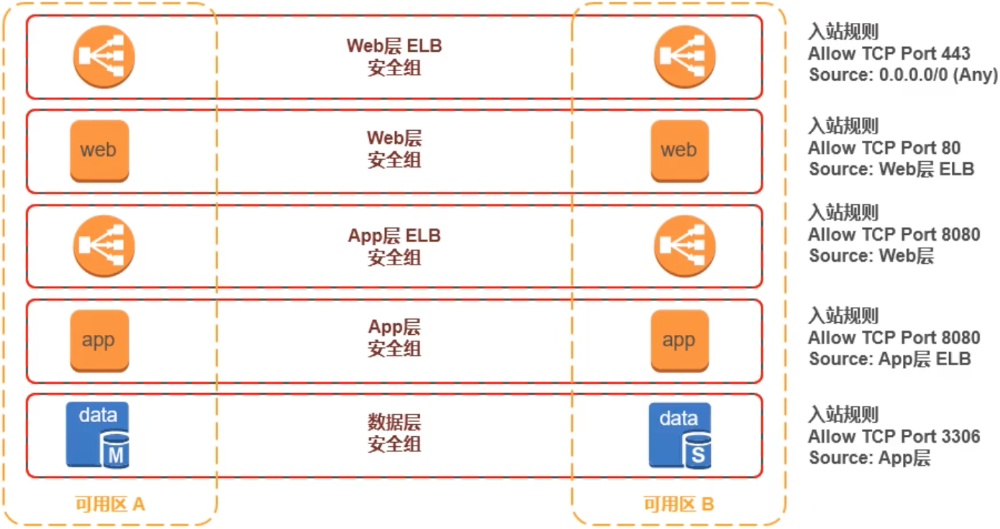
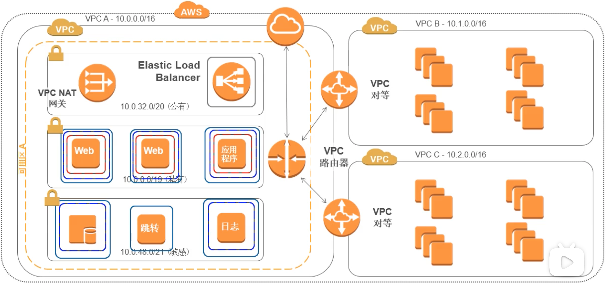
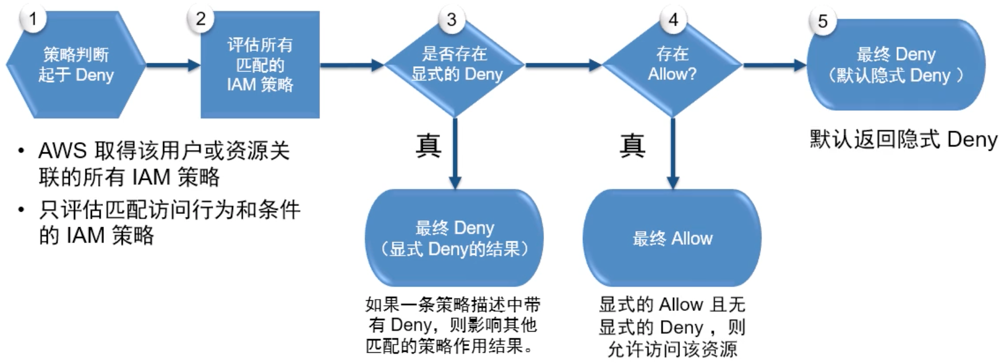
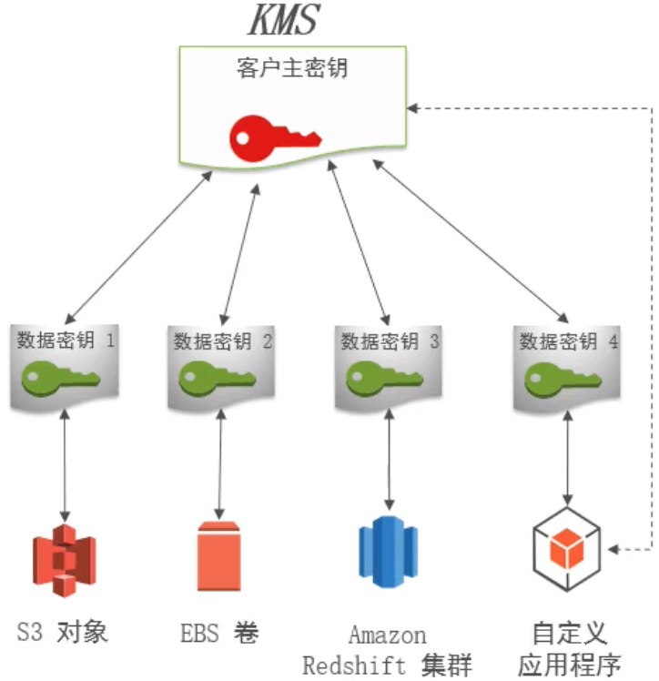
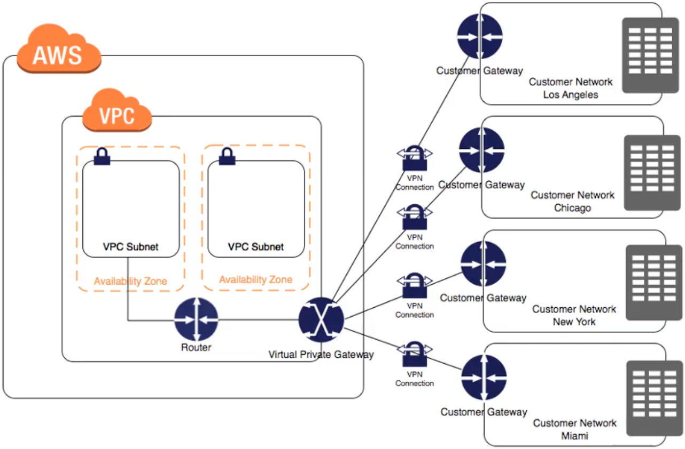
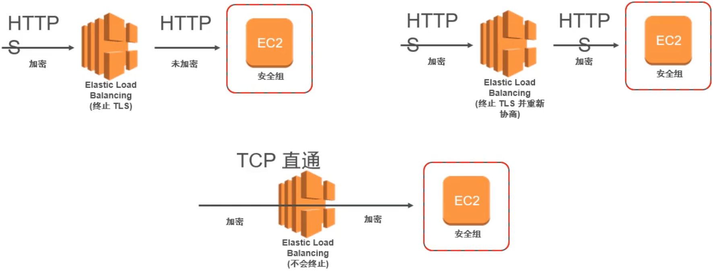
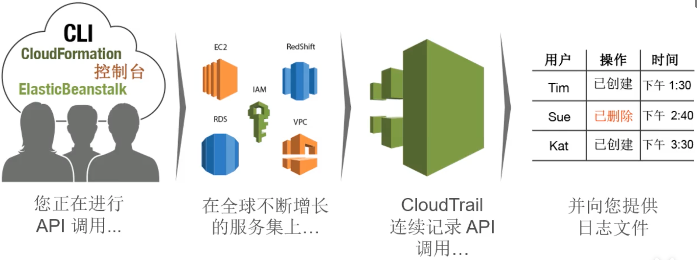
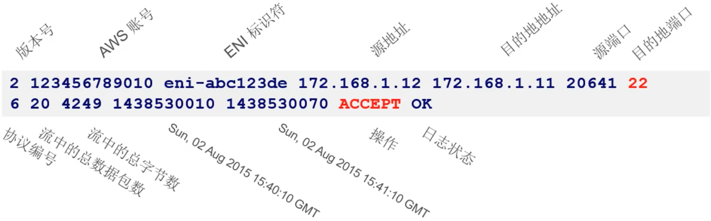

## 大纲

1. AWS 云安全蓝图
2. AWS 责任分担
3. 迁移安全最佳实践

## AWS 云安全蓝图

### 云采用框架

CAF 可标识对云的采用至关重要的利益相关者，它从 6 个视角组织相关的利益相关者。

通过这些"视角"，我们可以从这些利益相关者的角度了解云的采用情况。


### 安全视角

以更低的成本在更大的范围内更快地执行操作，同时仍然遵循公认的信息安全原则。

1. 建立安全指导控制机制
2. 标识预防性安全措施
3. 检查和检测可能违反规则和策略的情况
4. 创建安全响应行动手册


### 安全蓝图

AWS 定义了十个主题以构建云中安全维度，每个主题均有对应的最佳实践及适用的用户场景。

企业通过反复迭代，最终在保证业务需求及灵活性的同时，提升整体安全成熟度。

#### 五大核心

1. 账号及访问管理 (IAM)
2. 系统架构安全 (子网定义, 子网隔离, ACL, 安全组, etc...)
3. 数据分级及保护 (数据的存储与传输安全)
4. 安全运维，监控及日志管理 (CloudWatch, CloudTrail, etc...)
5. 事件响应及自动化 (行动手册, Config Rule)


#### 五大延展

1. 安全持续集成与交付
2. 合规性验证
3. 自适应能力
4. 配置及脆弱性分析
5. 大数据安全


## AWS 责任分担

在评估云解决方案的安全性时，理解和区分以下几点对于客户而言非常重要:

1. 云服务提供商 (AWS) 实施和运行的安全措施 - **云的安全性**
2. 客户实施和运行的安全措施，与使用 AWS 服务的客户内容和程序的安全相关 - **云中的安全性**


## 迁移安全最佳实践

### Virtual Private Cloud (VPC)

- 逻辑上隔离
- 软件定义的网络
- 虚拟网络
- 完全控制
- 安全
- 分配多个接口
- VPN 或 Internet 连接
- 连接您的内部 IT

### 定义你的应用环境

大多数用户选择以下两种模式来组合或者隔离他们的应用环境

#### 模式

- 多 VPC 模式

    - 用来将各应用环境创建在分散的 VPC 中
    - 适用于单一团队负责所有测试开发、生产环境基础架构的初创企业，或者中小企业 (SMB)

    

- 多账户模式

    - 将应用环境隔离在多个 AWS 账户中
    - 适用于拥有多个团队分别负责测试、生产环境的大型企业

    

- 多账户和多 VPC 混合模式
    

#### 决策

1. 多 VPC 还是多账户模式
    您准备使用哪种组织或者隔离模式来管理您的应用环境 ?

    - 单个团队的多 VPC 模式
        使用多 VPC 模式来管理和创建您的应用环境

    - 多个团队的多账户
        使用多账户模式来管理和隔离您的应用环境

2. Consolidated Billing
    当使用多账户模式时，哪个账户作为您的主 Master 账户 ?

    - 使用一个专门的主 (root) 账户，其上不启用任何 AWS 资源
    - 对这个主账户，启用 MFA

### 子网

#### 子网类型

1. 公有子网
    公有子网的路由表中，有路由指向 Internet Gateway (IGW), 流量能够直接进出因特网
2. 私有子网
    私有子网的路由表中，没有直接指向 Internet Gateway (IGW) 的路由，而是使用 proxy/NAT 网关实现因特网的出流量
3. 敏感子网 (自定义)
    敏感子网的路由表中，不含有进出因特网的路由

使用子网时的建议:

- 从每个可用区至少 2 个子网开始
- 使用子网来限制因特网的访问
- 考虑使用更大的子网 (/24 或者更大)

#### 决策

1. 每个可用区的子网划分
    您会选择使用多少子网 ? 什么类型的子网 ?

    - 从每个可用区至少 1 个公有子网，1 个私有子网开始
    - 如果您采用 3 层架构，建议使用 3 层子网结构。即公有子网、私有子网、敏感子网

    

### 安全组 & Network ACLs

#### 安全组

- 在实例级别运行
- 仅支持允许规则 (白名单)
- 有状态
- 每个安全组最多 50 条规则，最多支持 5 个组
- 默认禁止所有入站，允许所有出站
- 安全组的源可以是安全组


如何配置安全组:

- 安全组默认允许所有出流量的规则
- 在安全组上修改这条缺省的出流量规则会增加复杂性，因此不推荐，除非有合规的要求
- 大多数企业为每类应用在安全组中配置入站规则
- 优先考虑使用安全组作为源
- 如果要安全组内实例通讯，请将源设为自己



#### Network ACLs

- 在子网级别应用，无状态，默认情况下允许所有流量
- 允许和拒绝
- 适用于子网中的所有实例
- 用作第二道防线

#### 决策

1. 安全组策略
    您会使用安全组来作为您最主要的 EC2 实例访问控制方式吗 ?
    - 使用安全组作为您最主要的访问控制手段
2. NACL 策略
    什么时候在子网上启用 NACL 呢 ?
    - 当需要禁止来自某特定源或端口的流量时
    - 当子网无需访问因特网时

### VPC 的互连

#### 模式

- 使用 AWS 管理控制台或者 CLI 通过互联网连接
- 在您数据中心或公司与 VPC 间，建立 Virutal Private Network (VPN) over IPsec
    - 您可以在您的数据中心部署硬件 VPN，并同 VPC 中的 Virtual Private Gateway 建立 IPsec 隧道，来实现 VPN 连接
    - 中国区的 VPG 暂时不支持 VPN 功能
    - 您可以在您 VPC 中的 EC2 上安装开源的 VPN 软件，实现 VPN 连接。并通过多可用区部署以及健康检查脚本实现高可用
    - 您可以使用商业化的 VPN 解决方案
- AWS Direct Connect
    - 专用的私有链路
    - 持续的稳定性
    - 带宽: 50-500Mbps, 1Gbps, and 10Gbps
    - 大多数 VPN 解决方案最多支持 4Gbps
    - 支持主/主，主/备模式
- 通过 VPC peering 连接其他 VPC
    

#### 决策

- 使用 VPN
    大多数被迁移上云的应用并不需要专用链路，或者数据传输带宽要求小于 4Gbps
- 使用 Direct Connect
    如果您被迁移上云的应用需要更加稳定的链路，更加大的带宽，更加低的访问延时，考虑使用 Direct Connect

### 身份和访问管理

#### IAM

- 创建和管理 AWS 用户 (组)，以权限授予的方式允许或阻止其对 AWS 资源的访问
- 使用 SAML，并通过 AWS 目录服务和 AD 集成，实现联合身份认证
- 创建角色，并授予其相应权限，实现对单个实体或 AWS 服务 (如 EC2 实例) 有限的操作控制

#### 决策

1. IAM
    如何选择最佳的方式授予用户或应用权限 ?

    - 将 IAM 策略应用到组，避免应用到单个用户
    - 使用 IAM 角色可避免在代码中硬编码用户访问密钥
    - 重要用户启用 MFA
    - 务必配置密码策略，定期轮换密钥和密码

    

### 数据加密

#### 存储中的数据加密

##### KMS

使用信封加密的多层密钥层次结构

- 通过独一无二的数据密钥对单个客户数据进行加密
- 通过 KMS 主密钥对数据密钥进行加密
- 通过区域主密钥对客户 KMS 密钥进行加密



#### 传输中的数据加密

##### VPN



##### TLS 证书卸载



#### 决策

1. 密钥管理
    目前中国区暂时不支持 KMS，CloudHSM 密钥管理，我该如何选择 ?
    - 选择 AWS Server-side encryption (SSE) 加密
    - 选择合作伙伴的 KMS 或 HSM 解决方案
    - 选择在 OS 层以上进行加密的解决方案
2. 存储中的数据加密
    我应该加密云上哪些数据 ?
    - 根据企业需求或合规需求，对数据进行分级
    - 根据不同的数据级别制定不同的加密策略
3. TLS 证书卸载方式
    我应该选择哪种证书卸载方式 ?
    - 绝大多数企业选择在 ELB 上卸载证书，ELB 至后端 EC2 明文传输
    - 如果希望端到端的加密，建议选择由 ELB 先卸载 TLS 证书，再同后端的 EC2 建立加密通道

### 审计 & 日志

#### Amazon CloudTrail



为什么应该使用 CloudTrail ?

- 探测性控制 (并启用响应性控制)
- 安全操作可见性
- 操作故障排除
- 法规和标准合规性
    - PCI 数据安全标准 (PCI DSS)
    - FedRAMP: 美国政府联邦机构计划
    - 国际标准化组织 (ISO) 27001 标准
    - 服务组织控制 2 (SOC2)

#### Amazon VPC Flow Logs

- 您可以启用 VPC Flow Logs 来捕获有关在您的 VPC 中传入和传出网络接口的 IP 流量的信息
- 流日志数据使用 Amazon CloudWatch Logs 存储，大约每 10 分钟一批
- 除了故障排除之外，您可以使用 VPC Flow Logs 作为安全工具来监视到达您的实例的流量



#### 决策

1. AWS CloudTrail
    您是否准备在所有的区域启用 CloudTrail ? 如何存储日志 ?
    - 永远在所有的区域启用 CloudTrail
    - 将 CloudTrail 日志存储到独立的审计账号 S3 存储桶中，并利用 S3 生命周期管理，长期保存
2. VPC Flow Logs
    您是否在 VPC 中启用 Flow Logs ?
    - 在 Trouble Shooting 时启用 Flow Logs
    - 在应用测试、调试、试运行以及上线初期启用 Flow Logs
    - 配合 Splunk 等商业软件使用

### 杂项

#### AWS Config

AWS Config 为您提供 AWS 资源清单，在您的资源配置发生更改时通知您，并且可让您审核这些资源的配置历史记录

#### Config Rule

检查所记录配置有效性的规则 

- AWS 托管的规则
    - 由 AWS 定义
    - 所需配置极少 (或无需配置)
    - 由 AWS 维护的规则
- 客户托管的规则
    - 由您使用 AWS Lambda 编写
    - 规则在您账户中执行
    - 您负责维护规则

#### 决策

1. AWS Config
    您是否准备启用 AWS Config ?
    - 建议启用 AWS Config
2. Config Rule
    您是否准备启用 AWS Config Rule ?
    - 从启用 AWS 托管规则开始
    - 根据企业自身安全基线要求，或者合规要求，自己编写规则，实现 Compliance as Code

## 附录

### ARN 的格式

```yaml
arn:partition:service:region:account-id:resource
arn:partition:service:region:account-id:resourcetype/resource
arn:partition:service:region:account-id:resourcetype:resource
```

- Partition: 通常包括 aws, aws-cn 等
- Service: AWS 服务名称 (如 iam)
- Region: 资源所在的区域名称 (如，us-west-2)
- Account-id: AWS 账号 ID (如, 123456789012)

