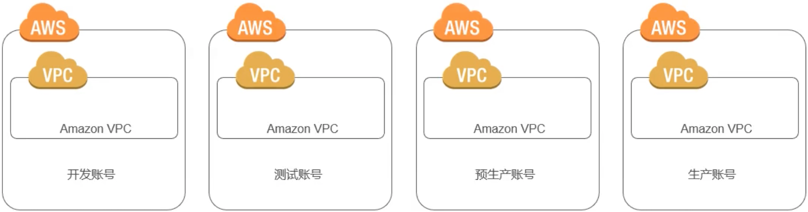

## 大纲

1. AWS 云安全蓝图
2. AWS 责任分担
3. 迁移安全最佳实践

## AWS 云安全蓝图

### 云采用框架

CAF 可标识对云的采用至关重要的利益相关者，它从 6 个视角组织相关的利益相关者。

通过这些"视角"，我们可以从这些利益相关者的角度了解云的采用情况。

### 安全视角

以更低的成本在更大的范围内更快地执行操作，同时仍然遵循公认的信息安全原则。

1. 建立安全指导控制机制
2. 标识预防性安全措施
3. 检查和检测可能违反规则和策略的情况
4. 创建安全响应行动手册

### 安全蓝图

AWS 定义了十个主题以构建云中安全维度，每个主题均有对应的最佳实践及适用的用户场景。

企业通过反复迭代，最终在保证业务需求及灵活性的同时，提升整体安全成熟度。

#### 五大核心

1. 账号及访问管理 (IAM)
2. 系统架构安全 (子网定义, 子网隔离, ACL, 安全组, etc...)
3. 数据分级及保护 (数据的存储与传输安全)
4. 安全运维，监控及日志管理 (CloudWatch, CloudTrail, etc...)
5. 事件响应及自动化 (行动手册, Config Rule)

#### 五大延展

1. 安全持续集成与交付
2. 合规性验证
3. 自适应能力
4. 配置及脆弱性分析
5. 大数据安全

## AWS 责任分担

在评估云解决方案的安全性时，理解和区分以下几点对于客户而言非常重要:

1. 云服务提供商 (AWS) 实施和运行的安全措施 - **云的安全性**
2. 客户实施和运行的安全措施，与使用 AWS 服务的客户内容和程序的安全相关 - **云中的安全性**

## 迁移安全最佳实践

### Virtual Private Cloud (VPC)

- 逻辑上隔离
- 软件定义的网络
- 虚拟网络
- 完全控制
- 安全
- 分配多个接口
- VPN 或 Internet 连接
- 连接您的内部 IT

### 定义你的应用环境

大多数用户选择以下两种模式来组合或者隔离他们的应用环境

#### 模式

- 多 VPC 模式

    - 用来将各应用环境创建在分散的 VPC 中
    - 适用于单一团队负责所有测试开发、生产环境基础架构的初创企业，或者中小企业 (SMB)

    

- 多账户模式

    - 将应用环境隔离在多个 AWS 账户中
    - 适用于拥有多个团队分别负责测试、生产环境的大型企业

    

- 多账户和多 VPC 混合模式
    

#### 决策

1. 多 VPC 还是多账户模式
    您准备使用哪种组织或者隔离模式来管理您的应用环境 ?

    - 单个团队的多 VPC 模式
        使用多 VPC 模式来管理和创建您的应用环境

    - 多个团队的多账户
        使用多账户模式来管理和隔离您的应用环境

2. Consolidated Billing
    当使用多账户模式时，哪个账户作为您的主 Master 账户 ?

    - 使用一个专门的主 (root) 账户，其上不启用任何 AWS 资源
    - 对这个主账户，启用 MFA

### 子网

#### 子网类型

1. 公有子网
    公有子网的路由表中，有路由指向 Internet Gateway (IGW), 流量能够直接进出因特网
2. 私有子网
    私有子网的路由表中，没有直接指向 Internet Gateway (IGW) 的路由，而是使用 proxy/NAT 网关实现因特网的出流量
3. 敏感子网 (自定义)
    敏感子网的路由表中，不含有进出因特网的路由

使用子网时的建议:

- 从每个可用区至少 2 个子网开始
- 使用子网来限制因特网的访问
- 考虑使用更大的子网 (/24 或者更大)

#### 决策

1. 每个可用区的子网划分
    您会选择使用多少子网 ? 什么类型的子网 ?

    - 从每个可用区至少 1 个公有子网，1 个私有子网开始
    - 如果您采用 3 层架构，建议使用 3 层子网结构。即公有子网、私有子网、敏感子网

    

### 安全组 & Network ACLs

#### 安全组

- 在实例级别运行
- 仅支持允许规则 (白名单)
- 有状态
- 每个安全组最多 50 条规则，最多支持 5 个组
- 默认禁止所有入站，允许所有出站
- 安全组的源可以是安全组

如何配置安全组:

- 安全组默认允许所有出流量的规则
- 在安全组上修改这条缺省的出流量规则会增加复杂性，因此不推荐，除非有合规的要求
- 大多数企业为每类应用在安全组中配置入站规则
- 优先考虑使用安全组作为源
- 如果要安全组内实例通讯，请将源设为自己

